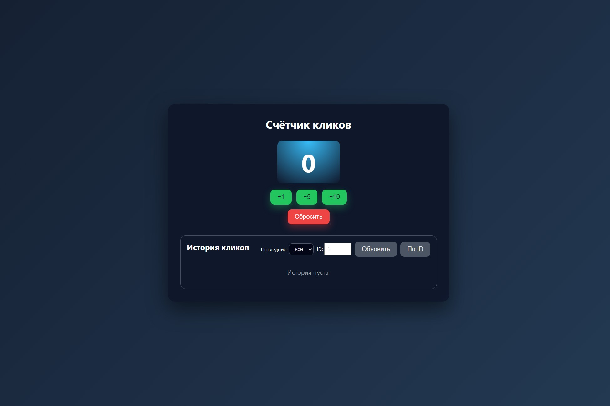
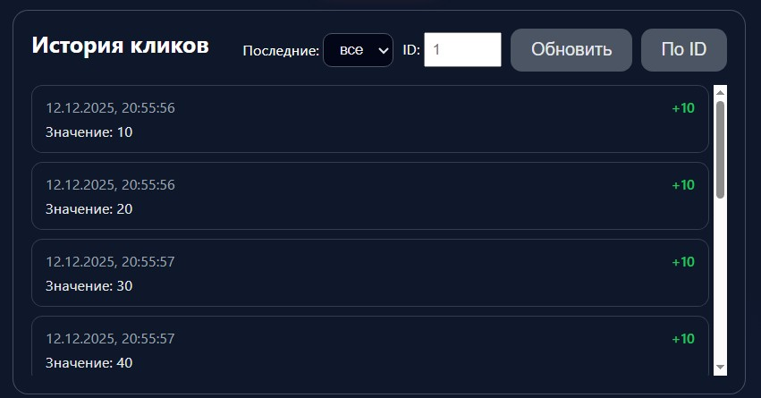
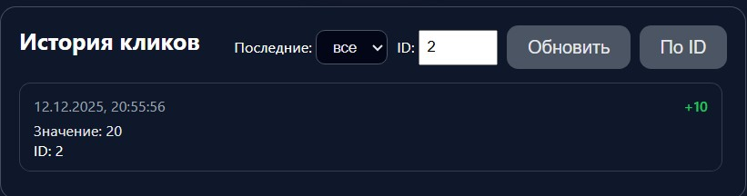

# 🖱️ Счётчик кликов

**Контрольная работа №5**  
**Тема 5: Счётчик кликов**

## 📋 Что делает приложение

Кликаешь кнопки — счётчик растёт. Можно посмотреть историю кликов и найти нужный клик по номеру.

## 📊 API

GET /api/clicks ← текущее число
POST /api/clicks ← +число (JSON)
POST /api/clicks/reset ← обнулить
GET /api/clicks/history ← история (?limit=5)
GET /api/clicks/entry/3 ← клик №3

## 📸 Скриншоты

  

## ✅ Чек-лист KR5

- [x] Express сервер — есть
- [x] GET/POST — есть  
- [x] req.params — поле ID
- [x] req.query — выпадающий список
- [x] express.json() — кнопки "+"
- [x] Middleware — logger.js
- [x] express.static() — HTML/CSS
- [x] routes + controllers — есть

**Студент: [Босарев Евгений Вадимович]**  
**Группа: [ЭФБО-11-24]**
